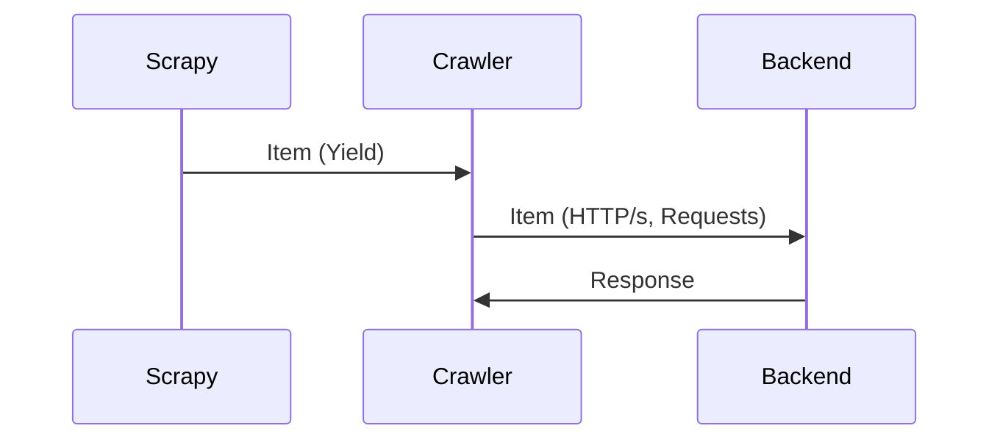
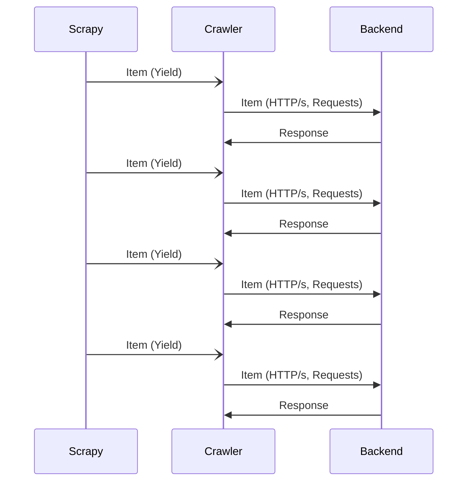
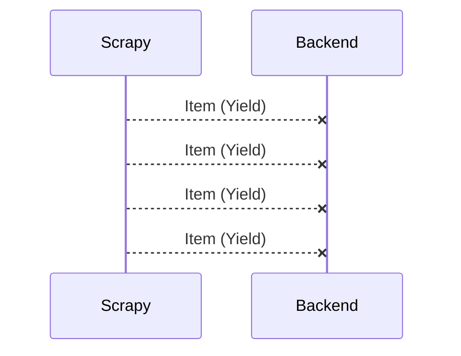
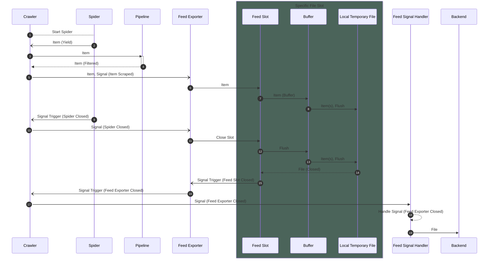

## 개요
Scrapy의 Feed Exports 기능을 제대로 활용해보자.

## 일반적인 구조와 문제점
Scrapy를 사용 시 비교적 모듈 관리가 잘 되지 않는다. 체계적인 구조나 모듈 관리 등이 이루어지지 않는 경우가 많은데, 아마도 소위 말하는 Best Practice 자체가 보기 힘들기 때문이 아닐까 싶다.

일반적으로 사용되는 간단한 웹 서버와 기본적인 파이프라인을 사용하여 데이터를 백엔드 단으로 전송하는 구조를 보면 다음과 같다.



대부분의 경우 Scrapy에서 상품을 단 건으로 API를 무한정 호출하는 모양새가 되며, 이 때문에 이를 처리하는 백엔드 단에서 많은 부하가 발생한다. 특히, **커넥션의 개수가 증가하는 경우가 빈번**하다.



결국엔 연결이 끊어지는 경우가 빈번하게 발생하며,



이를 처리하기 위해 **서버 측에서** 보완할 방법을 찾아야 한다.

또한 Scrapy 는 Twisted 기반의 비동기 방식으로 동작하기 때문에 Pipeline에서 동기 방식으로 처리하는 경우, Scrapy 의 수집을 블로킹하는 문제가 있다.

이를 방지하기 위해서는 비동기 방식으로 처리해야 하지만, 비동기 방식으로 처리한다고 안정적인 성능이나 개선된 속도를 보장할 수 있는 것은 아니다.

단 건 처리 시 이론적인 성능은 좋을 수 있으나, keep-alive 커넥션이나 커넥션 풀링, 세션 등의 기능을 사용하지 않는다면 HTTP 통신 과정 상 커넥션 수립과 해제에 백엔드 단에서 많은 부하가 발생한다. 이러한 문제들을 개선할 수 있는 것이 바로 Feed Exports 기능이다.

## Feed Exports
[Feed Exports](https://docs.scrapy.org/en/latest/topics/feed-exports.html) 공식 문서를 보면, 생각보다 문서가 빈약하고 특정한 파일 형식으로 추출이 가능하다는 정도만 보여지지만, **실제로는 다양한 파일 저장소에 원하는 형식과 규칙으로 매우 쉽게 저장이 가능하다.**

특히 AWS 측을 사용하고 있다면 S3에 즉각적으로 저장이 가능하다. 단, 장점만 있는 것은 아니며 파일을 저장하는 과정에서 덮어쓰기 방식으로 저장되기 때문에 비효율적일 수도 있다.

하지만 일반적으로 백엔드 서버와의 통신 과정에서 발생하는 커넥션 수립과 해제에 따른 부하를 크게 줄일 수 있으며, 이를 통해 백엔드 서버의 성능을 향상시킬 수 있다. 그리고 내장 기능이기 때문에 날로 먹기에도 좋다.

### Feed Exports 사용하기
[FEEDS 설정](https://docs.scrapy.org/en/latest/topics/feed-exports.html#feeds) 참고.

Feed Exports를 사용하기 위해서는 `FEEDS` 설정을 통해 사용할 파일 저장소를 지정해주면 된다. 아래는 S3에 저장하는 예제이다.

```python
FEEDS = {
    's3://bucket-name/path/to/file.jl': {
        'format': 'jl',
        'encoding': 'utf8',
        'store_empty': False,
        'indent': 4,
        'postprocessing': [
            'scrapy.extensions.postprocessing.GzipPlugin'
        ]
    },
}
```

일반적으로 [jsonlines](http://jsonlines.org/) 형식으로 저장하며, `postprocessing` 설정을 통해 압축 등의 후처리를 지원한다.
JSON 형식이나 CSV 등의 파일 형식 또한 지원되나, 하나의 파일 형식을 유지하기 위해 비효율적으로 처리하거나, 수집기 바깥에서 설정 값들을 설정해 주어야 하는 경우가 많아 번거롭다.

### Signal 응용하기

여기까지만 보면 이를 서버와 연동하는 것은 다소 어려워 보인다. 특히, 날짜나 특정한 커스텀 규칙에 따라서 보내주는 것은 어떻게 해야 할 지 의아하게 보인다.

하지만 Scrapy 는 [Signal](https://docs.scrapy.org/en/latest/topics/signals.html) 기능을 제공한다. 이를 통해 Feed Exports 기능을 사용하면, `FEEDS` 설정에 지정한 파일이 생성되는 이벤트가 발생하며, 해당 이벤트를 통지하는 시그널을 받아서 이에 대한 처리를 할 수 있다.

시그널들을 적극적으로 활용한다면, Scrapy 내부 시퀀스를 다음과 같이 도식화 할 수 있다.



따라서 API 를 무한정 호출하는 것이 아니라, **파일을 생성하는 시점에 백엔드 단으로 전송**하면 된다. 특히 S3 등의 외부 저장소를 사용한다면, 두 서비스 간의 통신 부하가 크게 줄어들게 된다. 또한, 일반적으로 동기/비동기 방식을 떠나 HTTP/s 통신 과정에서 수집 속도가 저하되는 경우가 많은데, 이를 통해 수집 속도를 극적으로 개선할 수 있다.

또한, 외부 저장소에 저장한 파일을 서버 측에서는 chunk 단위로 읽어서 bulk 처리하면 된다. 이를 통해 **커넥션 수립과 해제에 따른 부하를 크게 줄일 수 있다.**

단점으로는, 이 방법은 **실시간 처리가 불가능해지는 단점**이 있다. 하지만 그 정도로 실시간 성이 중요하다면 애초에 Scrapy 를 사용하지 않는 것이 좋다.

### 주의 사항
- Signal 을 사용하여 서버와 연동하는 경우, Scrapy에서 Signal 의 유형에 따라 `Deffered` 객체 지원 여부가 달라진다. 따라서 `Deffered` 객체를 지원하지 않는 경우, 서버와의 통신은 `Deffered` 기반의 비동기 방식으로 처리할 수 없다.

  * 지원하더라도, `Coroutine` 객체를 `Deferred` 객체로 변환하여 Return 처리 해야하므로, 다소 디버깅이 어려울 수 있다.

- `Coroutine` 객체를 `Deferred` 객체로 변환하기에는 까다로울 수 있으므로, scrapy 내부에 있는 `deferred_from_coro` 함수를 사용하는 것도 좋은 방법이다. [구현 코드](https://github.com/scrapy/scrapy/blob/6f73dc0e676b5ff440daae7f064e855eb0de428f/scrapy/utils/defer.py#L316C1-L328C13) 를 참고하는 것이 정신 건강에 좋다.

```python
def deferred_from_coro(o: _T) -> Union[Deferred, _T]:
    """Converts a coroutine into a Deferred, or returns the object as is if it isn't a coroutine"""
    if isinstance(o, Deferred):
        return o
    if asyncio.isfuture(o) or inspect.isawaitable(o):
        if not is_asyncio_reactor_installed():
            # wrapping the coroutine directly into a Deferred, this doesn't work correctly with coroutines
            # that use asyncio, e.g. "await asyncio.sleep(1)"
            return ensureDeferred(cast(Coroutine[Deferred, Any, Any], o))
        # wrapping the coroutine into a Future and then into a Deferred, this requires AsyncioSelectorReactor
        event_loop = _get_asyncio_event_loop()
        return Deferred.fromFuture(asyncio.ensure_future(o, loop=event_loop))
    return o
```

- `AsyncIO` 기반의 비동기 방식으로 처리하는 경우, `Twisted` 와 충돌이 발생할 수 있으므로 주의해야 한다.
