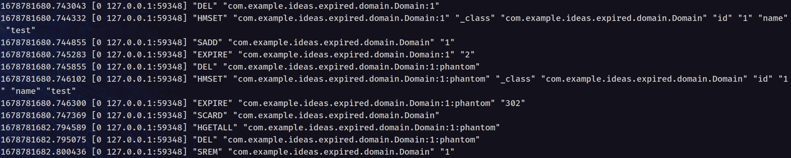

스프링에서는 Redis의 Key Expire (Keyspace) 이벤트를 활용할 수 있다. 내부 구현을 통해 이벤트를 발생시키는 방법을 알아보자.

# Key Expire 이벤트 발생

Redis 공식 문서[^1]에 따르면, Expire 이벤트를 수신하기 위해서는 최소한 다음과 같은 플래그 사용이 필요하다.

- E (__keyevent@<db>__ 접두사로 발행된 Keyevent 이벤트.)
- x (Key가 만료되었을 때 발생하는 이벤트.)

Redis에서 설정을 사용하기 위해서는 `redis.conf` 파일을 수정하거나, `redis-cli`를 통해 설정을 변경할 수 있다.
`redis.conf` 파일을 수정하는 경우, 다음과 같이 설정을 수정한다.

```text
notify-keyspace-events "Ex"
```

`redis-cli`를 통해 설정을 변경하는 경우, 다음과 같이 설정을 변경한다.

```bash
redis-cli CONFIG SET notify-keyspace-events "Ex"
```

# Key Expire 이벤트 수신

Spring에서는 Redis의 Key Expire 이벤트를 수신하기 위해서는 다음과 같은 설정이 필요하다.

```java

@EnableRedisRepositories(enableKeyspaceEvents = EnableKeyspaceEvents.ON_STARTUP)
public class RedisConfig {
    ...
}
```

대체 이 어노테이션이 `@EnableRedisRepositories` 어떤 기능을 하는지 알아보자.

## `@EnableRedisRepositories` 어노테이션의 작동 방식

`@EnableRedisRepositories` 어노테이션은 다음과 같이 정의되어 있다.<sup>[2](#footnote_2)</sup>

```java
/*
 * Copyright 2015-2023 the original author or authors.
 *
 * Licensed under the Apache License, Version 2.0 (the "License");
 * you may not use this file except in compliance with the License.
 * You may obtain a copy of the License at
 *
 *      https://www.apache.org/licenses/LICENSE-2.0
 *
 * Unless required by applicable law or agreed to in writing, software
 * distributed under the License is distributed on an "AS IS" BASIS,
 * WITHOUT WARRANTIES OR CONDITIONS OF ANY KIND, either express or implied.
 * See the License for the specific language governing permissions and
 * limitations under the License.
 */
package org.springframework.data.redis.repository.configuration;

import java.lang.annotation.Documented;
import java.lang.annotation.ElementType;
import java.lang.annotation.Inherited;
import java.lang.annotation.Retention;
import java.lang.annotation.RetentionPolicy;
import java.lang.annotation.Target;

import org.springframework.beans.factory.FactoryBean;
import org.springframework.context.annotation.ComponentScan.Filter;
import org.springframework.context.annotation.Import;
import org.springframework.data.keyvalue.core.KeyValueOperations;
import org.springframework.data.keyvalue.repository.config.QueryCreatorType;
import org.springframework.data.redis.core.RedisKeyValueAdapter.EnableKeyspaceEvents;
import org.springframework.data.redis.core.RedisKeyValueAdapter.ShadowCopy;
import org.springframework.data.redis.core.RedisOperations;
import org.springframework.data.redis.core.convert.KeyspaceConfiguration;
import org.springframework.data.redis.core.index.IndexConfiguration;
import org.springframework.data.redis.listener.KeyExpirationEventMessageListener;
import org.springframework.data.redis.repository.query.RedisQueryCreator;
import org.springframework.data.redis.repository.support.RedisRepositoryFactoryBean;
import org.springframework.data.repository.config.DefaultRepositoryBaseClass;
import org.springframework.data.repository.query.QueryLookupStrategy;
import org.springframework.data.repository.query.QueryLookupStrategy.Key;

/**
 * Annotation to activate Redis repositories. If no base package is configured through either {@link #value()},
 * {@link #basePackages()} or {@link #basePackageClasses()} it will trigger scanning of the package of annotated class.
 *
 * @author Christoph Strobl
 * @author Mark Paluch
 * @since 1.7
 */
@Target(ElementType.TYPE)
@Retention(RetentionPolicy.RUNTIME)
@Documented
@Inherited
@Import(RedisRepositoriesRegistrar.class)
@QueryCreatorType(RedisQueryCreator.class)
public @interface EnableRedisRepositories {

    /**
     * Alias for the {@link #basePackages()} attribute. Allows for more concise annotation declarations e.g.:
     * {@code @EnableRedisRepositories("org.my.pkg")} instead of
     * {@code @EnableRedisRepositories(basePackages="org.my.pkg")}.
     */
    String[] value() default {};

    /**
     * Base packages to scan for annotated components. {@link #value()} is an alias for (and mutually exclusive with) this
     * attribute. Use {@link #basePackageClasses()} for a type-safe alternative to String-based package names.
     */
    String[] basePackages() default {};

    /**
     * Type-safe alternative to {@link #basePackages()} for specifying the packages to scan for annotated components. The
     * package of each class specified will be scanned. Consider creating a special no-op marker class or interface in
     * each package that serves no purpose other than being referenced by this attribute.
     */
    Class<?>[] basePackageClasses() default {};

    /**
     * Specifies which types are not eligible for component scanning.
     */
    Filter[] excludeFilters() default {};

    /**
     * Specifies which types are eligible for component scanning. Further narrows the set of candidate components from
     * everything in {@link #basePackages()} to everything in the base packages that matches the given filter or filters.
     */
    Filter[] includeFilters() default {};

    /**
     * Returns the postfix to be used when looking up custom repository implementations. Defaults to {@literal Impl}. So
     * for a repository named {@code PersonRepository} the corresponding implementation class will be looked up scanning
     * for {@code PersonRepositoryImpl}.
     *
     * @return
     */
    String repositoryImplementationPostfix() default "Impl";

    /**
     * Configures the location of where to find the Spring Data named queries properties file.
     *
     * @return
     */
    String namedQueriesLocation() default "";

    /**
     * Returns the key of the {@link QueryLookupStrategy} to be used for lookup queries for query methods. Defaults to
     * {@link Key#CREATE_IF_NOT_FOUND}.
     *
     * @return
     */
    Key queryLookupStrategy() default Key.CREATE_IF_NOT_FOUND;

    /**
     * Returns the {@link FactoryBean} class to be used for each repository instance. Defaults to
     * {@link RedisRepositoryFactoryBean}.
     *
     * @return
     */
    Class<?> repositoryFactoryBeanClass() default RedisRepositoryFactoryBean.class;

    /**
     * Configure the repository base class to be used to create repository proxies for this particular configuration.
     *
     * @return
     */
    Class<?> repositoryBaseClass() default DefaultRepositoryBaseClass.class;

    /**
     * Configures the name of the {@link KeyValueOperations} bean to be used with the repositories detected.
     *
     * @return
     */
    String keyValueTemplateRef() default "redisKeyValueTemplate";

    /**
     * Configures whether nested repository-interfaces (e.g. defined as inner classes) should be discovered by the
     * repositories infrastructure.
     */
    boolean considerNestedRepositories() default false;

    /**
     * Configures the bean name of the {@link RedisOperations} to be used. Defaulted to {@literal redisTemplate}.
     *
     * @return
     */
    String redisTemplateRef() default "redisTemplate";

    /**
     * Set up index patterns using simple configuration class.
     *
     * @return
     */
    Class<? extends IndexConfiguration> indexConfiguration() default IndexConfiguration.class;

    /**
     * Set up keyspaces for specific types.
     *
     * @return
     */
    Class<? extends KeyspaceConfiguration> keyspaceConfiguration() default KeyspaceConfiguration.class;

    /**
     * Configure usage of {@link KeyExpirationEventMessageListener}.
     *
     * @return
     * @since 1.8
     */
    EnableKeyspaceEvents enableKeyspaceEvents() default EnableKeyspaceEvents.OFF;

    /**
     * Configure the name of the {@link org.springframework.data.redis.listener.RedisMessageListenerContainer} bean to be
     * used for keyspace event subscriptions. Defaults to use an anonymous managed instance by
     * {@link org.springframework.data.redis.core.RedisKeyValueAdapter}.
     *
     * @return
     * @since 2.7.2
     */
    String messageListenerContainerRef() default "";

    /**
     * Configuration flag controlling storage of phantom keys (shadow copies) of expiring entities to read them later when
     * publishing {@link org.springframework.data.redis.core.RedisKeyspaceEvent keyspace events}.
     *
     * @return
     * @since 2.4
     */
    ShadowCopy shadowCopy() default ShadowCopy.DEFAULT;

    /**
     * Configure the {@literal notify-keyspace-events} property if not already set. <br />
     * Use an empty {@link String} to keep (<b>not</b> alter) existing server configuration.
     *
     * @return {@literal Ex} by default.
     * @since 1.8
     */
    String keyspaceNotificationsConfigParameter() default "Ex";

}
```

클래스와 메서드에 작성되어 있는 주석들을 잘 살펴보면 다음과 같은 중요한 부분들을 발견할 수 있다.

### MessageListenerContainerRef 설정

```java
/**
 * Configure the name of the {@link org.springframework.data.redis.listener.RedisMessageListenerContainer} bean to be
 * used for keyspace event subscriptions. Defaults to use an anonymous managed instance by
 * {@link org.springframework.data.redis.core.RedisKeyValueAdapter}.
 *
 * @return
 * @since 2.7.2
 */
String messageListenerContainerRef()default "";
```

`RedisMessageListenerContainer` 에 사용할 빈의 이름을 설정한다. 기본값은 `RedisKeyValueAdapter` 에 의해 관리되는 객체를 사용한다.

`RedisKeyValueAdapter` 에서는 다음과 같이 컨테이너 객체를 생성하고 있다.

```java
private void initMessageListenerContainer(){ // `MessageListenerContainer` 초기화

    this.messageListenerContainer=new RedisMessageListenerContainer(); // `RedisMessageListenerContainer` 생성
    // `RedisMessageListenerContainer` 에 ConnectionFactory 설정
    this.messageListenerContainer.setConnectionFactory(((RedisTemplate<?, ?>)redisOps).getConnectionFactory());
    // 스레드풀, 비동기 처리 등 설정
    this.messageListenerContainer.afterPropertiesSet();
    // container 시작 처리
    this.messageListenerContainer.start();
    }
```

### Keyspace Notification 설정

```java
/**
 * Configure the {@literal notify-keyspace-events} property if not already set. <br />
 * Use an empty {@link String} to keep (<b>not</b> alter) existing server configuration.
 *
 * @return {@literal Ex} by default.
 * @since 1.8
 */

// `notify-keyspace-events` 가 설정되어 있지 않다면, `Ex` 로 설정한다. 빈 문자열을 사용하면 기존 설정을 유지한다.
String keyspaceNotificationsConfigParameter()default "Ex";
```

위의 Redis의 Keyspace Notification 설정에서 보았듯이, Key Expire 이벤트를 수신하기 위해서는 최소한 `Ex` 옵션을 설정해야 한다. 이러한
동작을 `@EnableRedisRepositories` 어노테이션을 사용하는 것 만으로 수행할 수 있다.

이 옵션 문자열은 `RedisKeyValueAdapter` 에서 사용된다.

### EnableKeyspaceEvents 설정

```java
/**
 * Configure usage of {@link KeyExpirationEventMessageListener}.
 *
 * @return
 * @since 1.8
 */
EnableKeyspaceEvents enableKeyspaceEvents()default EnableKeyspaceEvents.OFF;
```

주석을 살펴보면, `KeyExpirationEventMessageListener` 를 사용할 것인지를 설정하는 부분이다. `EnableKeyspaceEvents` 는 다음과 같은 Enum 타입이다.

```java
public enum EnableKeyspaceEvents {

    /**
     * Initializes the {@link KeyExpirationEventMessageListener} on startup.
     */
    // 애플리케이션 시작 시에 KeyExpirationEventMessageListener를 초기화한다.
    ON_STARTUP,

    /**
     * Initializes the {@link KeyExpirationEventMessageListener} on first insert having expiration time set.
     */
    // 첫번째 expire 시간이 설정된 데이터가 insert 될 때 KeyExpirationEventMessageListener를 초기화한다.
    ON_DEMAND,

    /**
     * Turn {@link KeyExpirationEventMessageListener} usage off. No expiration events will be received.
     */
    // 사용하지 않는다.
    OFF
}
```

`KeyExpirationEventMessageListener` 속성은 실제로 `RedisKeyValueAdapter` 에서 다음과 같이 설정된다.

```java
private void initKeyExpirationListener(){

    // Expire 이벤트 리스너가 없는 경우
    if(this.expirationListener.get()==null){

    // 기본적인 Expire 이벤트를 처리하는 매핑 리스너 클래스를 생성한다.
    MappingExpirationListener listener=new MappingExpirationListener(this.messageListenerContainer,this.redisOps,
    this.converter);
    // Expire 설정 파라미터 값을 설정한다. (이전에 본 기본값인 "Ex" 또는 별도의 설정 값)
    listener.setKeyspaceNotificationsConfigParameter(keyspaceNotificationsConfigParameter);

    // 애플리케이션 이벤트 발행자가 설정되어 있는 경우, 매핑 리스너에 설정한다.
    if(this.eventPublisher!=null){
    listener.setApplicationEventPublisher(this.eventPublisher);
    }

    // Expire 이벤트 리스너가 설정되어 있지 않은 경우, 매핑 리스너를 초기화 하고 설정한다.
    if(this.expirationListener.compareAndSet(null,listener)){
    listener.init();
    }
    }
    }
```

이 함수를 `ON_STARTUP` 으로 설정하면, 애플리케이션 시작 시에 `KeyExpirationEventMessageListener` 가 초기화 되고[2], `ON_DEMAND` 로 설정하면, 첫번째 expire
시간이 설정된 데이터가 insert 될 때 `KeyExpirationEventMessageListener` 가 초기화 된다.

### ShadowCopy 설정

```java
/**
 * Configuration flag controlling storage of phantom keys (shadow copies) of expiring entities to read them later when
 * publishing {@link org.springframework.data.redis.core.RedisKeyspaceEvent keyspace events}.
 *
 * @return
 * @since 2.4
 */
ShadowCopy shadowCopy()default ShadowCopy.DEFAULT;
```

`ShadowCopy` 는 다음과 같은 Enum 타입이다. 기본적으로 `DEFAULT` 로 설정되어 있다.

```java
/**
 * Configuration flag controlling storage of phantom keys (shadow copies) of expiring entities to read them later when
 * publishing {@link RedisKeyspaceEvent}.
 *
 * @author Christoph Strobl
 * @since 2.4
 */
public enum ShadowCopy {

    /**
     * Store shadow copies of expiring entities depending on the {@link EnableKeyspaceEvents}.
     */
    DEFAULT,

    /**
     * Store shadow copies of expiring entities.
     */
    ON,

    /**
     * Do not store shadow copies.
     */
    OFF
}
```

`ShadowCopy` 가 설정되어 있으면 `RedisKeyValueAdapter` 에서 다음과 같이 처리된다.

```java
private boolean keepShadowCopy(){

    switch(shadowCopy){
    case OFF:
    return false;
    case ON:
    return true;
default:
    return this.expirationListener.get()!=null;
    }
    }
```

위의 함수는 `ShadowCopy` 가 `ON` 이거나 (`DEFAULT` 이고 Expire 이벤트 리스너가 있는 경우) `true`, 그렇지 않으면 `false` 를 반환한다.

- put: `keepShadowCopy` 가 `true` 인 경우, `:phantom` 접미사를 가진 키를 생성한다.
- delete: `keepShadowCopy` 가 `true` 인 경우, `:phantom` 접미사를 가진 키를 삭제한다.
- update: `keepShadowCopy` 가 `true` 인 경우, `TTL` 시간이 초과된 경우 `:phantom` 접미사를 가진 키를 삭제한다. `TTL` 시간이 초과되지 않은 경우, `:phantom`
  접미사를 가진 키의 값과 `TTL` 시간을 업데이트한다.

이 옵션이 켜져 있어야 `RedisKeyExpiredEvent` 를 사용할 수 있다. 하지만 문제점으로 `ShadowCopy` 가 켜져 있으면, `:phantom` 이라는 접미사를 가진 키가 생성되어 메모리 사용량이
증가한다. `RedisKeyExpiredEvent` 를 사용하지 않는다면, `ShadowCopy` 를 `OFF` 로 설정해야 메모리 사용량을 줄일 수 있다.[^3],[^4]

`ShadowCopy` 옵션을 사용 시 다음과 같이, `:phantom` 이라는 접미사를 가진 키가 생성되는 것을 확인할 수 있다.


## 왜 `RedisKeyExpiredEvent` 이벤트를 사용하는가?

여러가지 이유가 있겠지만, 가장 중요한 것은 **개발자의 고통을 크게 줄여줄 수 있기 때문이라고 생각한다**. 다른 문서나 개발 예시들을 보면 비교적 로우 레벨인 `redisTemplate` 를 사용하는 것을 쉽게
볼 수 있는데, redisTemplate를 사용하기 위해서는 다음과 같은 요구사항들과 과정을 거쳐야한다.

- 모든 사소한 데이터의 CRUD 작업을 직접 구현해야 한다.
- 모든 `TTL` 값을 직접 실행해야 한다.
- `TTL` 값이 초과된 데이터를 직접 삭제해야 한다. (이 때, `TTL` 값이 초과된 데이터를 찾기 위해서 반복적으로 조회하거나 최소한의 모니터링이 필요하다.)

이 부분 중 하나라도 실수가 나거나 누락되면, 데이터가 정상적으로 삭제되지 않고 남아있는 문제가 발생할 수 있다. 이러한 실수를 줄이거나 방지할 수는 있겠지만, 개발자가 실수를 하지 않는다는 것은 불가능하다.
그래서 `RedisKeyExpiredEvent` 를 사용하면, 이러한 고통을 크게 줄일 수 있다.

## 어떻게 `RedisKeyExpiredEvent` 가 발행되는가?

이를 이해하기 위해서는 `KeyExpirationEventMessageListener` 의 내부 구현을 살펴보면 된다.

이에 앞서 다시 `RedisKeyExpiredEvent` 의 코드 일부분을 살펴보면 다음과 같다.

```java
@Override
public void setApplicationContext(ApplicationContext applicationContext)throws BeansException{
    this.eventPublisher=applicationContext;
    }
```

`ApplicationContext` 를 받아서 `eventPublisher` 변수에 저장하는 것을 볼 수 있다. 이를 사용하여 `RedisKeyExpiredEvent` 를 발행한다.

```java
/*
 * Copyright 2015-2023 the original author or authors.
 *
 * Licensed under the Apache License, Version 2.0 (the "License");
 * you may not use this file except in compliance with the License.
 * You may obtain a copy of the License at
 *
 *      https://www.apache.org/licenses/LICENSE-2.0
 *
 * Unless required by applicable law or agreed to in writing, software
 * distributed under the License is distributed on an "AS IS" BASIS,
 * WITHOUT WARRANTIES OR CONDITIONS OF ANY KIND, either express or implied.
 * See the License for the specific language governing permissions and
 * limitations under the License.
 */
package org.springframework.data.redis.listener;

import org.springframework.context.ApplicationEventPublisher;
import org.springframework.context.ApplicationEventPublisherAware;
import org.springframework.data.redis.connection.Message;
import org.springframework.data.redis.connection.MessageListener;
import org.springframework.data.redis.core.RedisKeyExpiredEvent;
import org.springframework.lang.Nullable;

/**
 * {@link MessageListener} publishing {@link RedisKeyExpiredEvent}s via {@link ApplicationEventPublisher} by listening
 * to Redis keyspace notifications for key expirations.
 *
 * @author Christoph Strobl
 * @since 1.7
 */
// `ApplicationEventPublisher` 를 통해서 `RedisKeyExpiredEvent` 를 발행하는 `MessageListener` 구현체
public class KeyExpirationEventMessageListener extends KeyspaceEventMessageListener implements
    ApplicationEventPublisherAware {

    // `__keyevent@*__:expired` 메시지를 수신하는 `Topic`
    private static final Topic KEYEVENT_EXPIRED_TOPIC = new PatternTopic("__keyevent@*__:expired");

    // `ApplicationEventPublisher` 를 통해서 `RedisKeyExpiredEvent` 를 발행한다. `ApplicationEventPublisher` 는 `ApplicationContext`이다.
    private @Nullable ApplicationEventPublisher publisher;

    /**
     * Creates new {@link MessageListener} for {@code __keyevent@*__:expired} messages.
     *
     * @param listenerContainer must not be {@literal null}.
     */
    // `KEYEVENT_EXPIRED_TOPIC` 을 구독하는 `MessageListener` 를 생성한다.
    public KeyExpirationEventMessageListener(RedisMessageListenerContainer listenerContainer) {
        super(listenerContainer);
    }

    // `KEYEVENT_EXPIRED_TOPIC` 을 구독한다.
    @Override
    protected void doRegister(RedisMessageListenerContainer listenerContainer) {
        listenerContainer.addMessageListener(this, KEYEVENT_EXPIRED_TOPIC);
    }

    // 메시지 수신 시, 메시지의 바디를 `RedisKeyExpiredEvent` 로 변환하여 `ApplicationEventPublisher` 를 통해 발행한다.
    @Override
    protected void doHandleMessage(Message message) {
        publishEvent(new RedisKeyExpiredEvent(message.getBody()));
    }

    /**
     * Publish the event in case an {@link ApplicationEventPublisher} is set.
     *
     * @param event can be {@literal null}.
     */
    // `ApplicationEventPublisher` 를 통해 `RedisKeyExpiredEvent` 를 발행한다.
    protected void publishEvent(RedisKeyExpiredEvent event) {

        if (publisher != null) {
            this.publisher.publishEvent(event);
        }
    }

    // `ApplicationEventPublisher` 를 주입 받는다.
    @Override
    public void setApplicationEventPublisher(ApplicationEventPublisher applicationEventPublisher) {
        this.publisher = applicationEventPublisher;
    }
}

```  

## 어떻게 `RedisKeyExpiredEvent` 를 사용하는가?

`RedisKeyExpiredEvent` 를 사용하는 방법은 크게 두 가지로 나눌 수 있다. 다른 방법이 더 있겠지만, 너무 복잡해서 굳이 다루지는 않는다.

### `KeyExpirationEventMessageListener` 를 직접 상속, 구현

`RedisKeyValueAdapter` 의 내부에서 사용되는 `KeyExpirationEventMessageListener` 를 구현하는 리스너의 예시 코드를 보자.

```java
static class MappingExpirationListener extends KeyExpirationEventMessageListener {

    private final RedisOperations<?, ?> ops;
    private final RedisConverter converter;

    /**
     * Creates new {@link MappingExpirationListener}.
     *
     * @param listenerContainer
     * @param ops
     * @param converter
     */
    MappingExpirationListener(
        RedisMessageListenerContainer listenerContainer, RedisOperations<?, ?> ops,
        RedisConverter converter
    ) {

        super(listenerContainer);
        this.ops = ops;
        this.converter = converter;
    }

    @Override
    public void onMessage(Message message, @Nullable byte[] pattern) {

        if (!isKeyExpirationMessage(message)) {
            return;
        }

        byte[] key = message.getBody();

        byte[] phantomKey = ByteUtils.concat(
            key,
            converter.getConversionService().convert(KeyspaceIdentifier.PHANTOM_SUFFIX, byte[].class)
        );

        Map<byte[], byte[]> hash = ops.execute((RedisCallback<Map<byte[], byte[]>>) connection -> {

            Map<byte[], byte[]> hash1 = connection.hGetAll(phantomKey);

            if (!CollectionUtils.isEmpty(hash1)) {
                connection.del(phantomKey);
            }

            return hash1;
        });

        Object value = CollectionUtils.isEmpty(hash) ? null : converter.read(Object.class, new RedisData(hash));

        byte[] channelAsBytes = message.getChannel();
        String channel = !ObjectUtils.isEmpty(channelAsBytes)
            ? converter.getConversionService().convert(channelAsBytes, String.class)
            : null;

        RedisKeyExpiredEvent event = new RedisKeyExpiredEvent(channel, key, value);

        ops.execute((RedisCallback<Void>) connection -> {

            connection.sRem(converter.getConversionService().convert(event.getKeyspace(), byte[].class), event.getId());
            new IndexWriter(connection, converter).removeKeyFromIndexes(event.getKeyspace(), event.getId());
            return null;
        });

        publishEvent(event);
    }

    private boolean isKeyExpirationMessage(Message message) {
        return BinaryKeyspaceIdentifier.isValid(message.getBody());
    }
}
```

보기만 해도 복잡하다.

대략 다음과 같은 일들을 하고 있음을 알 수 있다.

- Redis에서 `__keyevent@*__:expired` 메시지를 수신한다.
- 메시지를 `RedisKeyExpiredEvent` 로 변환하고, 발행한다.
- 불필요한 `PhantomKey` 를 삭제한다.

이와 유사한 방식으로 `KeyExpirationEventMessageListener` 를 상속받아 구현하면 된다. 나는 매우 게으른 사람이기에 위 방법을 사용하지 않는다.

### `RedisKeyExpiredEvent` 를 `@EventListener` 로 처리한다.

매우 간편하고 실용적인 방법이다.

관련하여 내가 직접 작성한 미천한 테스트 코드를 보자.[^5]

#### Domain.java

```java
package com.example.ideas.expired.domain;

import java.io.Serializable;

import org.springframework.data.annotation.Id;
import org.springframework.data.redis.core.RedisHash;

import lombok.Value;


@RedisHash(timeToLive = 2L)
@Value
public class Domain implements Serializable {

    @Id
    Long id;
    String name;

    public Domain(Long id, String name) {
        this.id = id;
        this.name = name;
    }
}
```

#### DomainRepository.java

```java
package com.example.ideas.expired.repository;

import org.springframework.data.repository.CrudRepository;

import com.example.ideas.expired.domain.Domain;

public interface DomainRepository extends CrudRepository<Domain, Long> {

}
```

#### Dumb.java

```java
package com.example.ideas.expired.domain;

import java.io.Serializable;

import org.springframework.data.annotation.Id;
import org.springframework.data.redis.core.RedisHash;

import lombok.Value;

@RedisHash(timeToLive = 3L)
@Value
public class Dumb implements Serializable {


    @Id
    Long id;

    Double value;

    public Dumb(Long id, Double value) {
        this.id = id;
        this.value = value;
    }
}
```

#### DumbRepository.java

```java
package com.example.ideas.expired.repository;

import org.springframework.data.repository.CrudRepository;

import com.example.ideas.expired.domain.Dumb;

public interface DumbRepository extends CrudRepository<Dumb, Long> {

}
```

#### RedisTemplateConfig.java

```java
package com.example.ideas.expired.config;

import org.springframework.boot.autoconfigure.data.redis.RedisProperties;
import org.springframework.context.annotation.Bean;
import org.springframework.context.annotation.Configuration;
import org.springframework.data.redis.connection.RedisConnectionFactory;
import org.springframework.data.redis.connection.lettuce.LettuceConnectionFactory;
import org.springframework.data.redis.core.RedisTemplate;
import org.springframework.data.redis.serializer.GenericJackson2JsonRedisSerializer;
import org.springframework.data.redis.serializer.StringRedisSerializer;

import lombok.RequiredArgsConstructor;

@Configuration
@RequiredArgsConstructor
public class RedisTemplateConfig {

    private final RedisProperties redisProperties;

    @Bean
    public RedisConnectionFactory lettuceConnectionFactory() {
        return new LettuceConnectionFactory(redisProperties.getHost(), redisProperties.getPort());
    }

    @Bean
    public RedisTemplate<String, Object> redisTemplate(RedisConnectionFactory connectionFactory) {
        RedisTemplate<String, Object> redisTemplate = new RedisTemplate<>();
        redisTemplate.setConnectionFactory(connectionFactory);
        redisTemplate.setKeySerializer(new StringRedisSerializer());
        redisTemplate.setValueSerializer(new GenericJackson2JsonRedisSerializer());
        return redisTemplate;
    }
}

```

#### ExpiredListener.java

```java
package com.example.ideas.expired.listener;


import org.springframework.context.event.EventListener;
import org.springframework.data.redis.core.RedisKeyExpiredEvent;
import org.springframework.stereotype.Component;

import com.example.ideas.expired.domain.Domain;

import lombok.Getter;
import lombok.extern.slf4j.Slf4j;

@Slf4j
@Component
@Getter
public class ExpiredListener {

    private int domainCount = 0;
    private int othersCount = 0;

    @EventListener
    public void handleExpiredEvent(RedisKeyExpiredEvent<Domain> event) {
        if (event.getValue() instanceof Domain domainValue) {
            log.info("Domain event received: {}", event);
            log.info("Domain event source: {}", event.getSource());
            log.info("Domain event keyspace: {}", event.getKeyspace());
            log.info("Domain event channel: {}", event.getChannel());
            log.info("Domain event id: {}", event.getId());
            log.info("Domain event timestamp: {}", event.getTimestamp());
            log.info("Domain event class: {}", event.getClass());
            log.info("Domain event value: {}", domainValue);
            domainCount += 1;
        } else {
            log.info("Unknown event received: {}", event);
            log.info("Unknown event source: {}", event.getSource());
            log.info("Unknown event keyspace: {}", event.getKeyspace());
            log.info("Unknown event channel: {}", event.getChannel());
            log.info("Unknown event id: {}", event.getId());
            log.info("Unknown event timestamp: {}", event.getTimestamp());
            log.info("Unknown event class: {}", event.getClass());
            log.info("Unknown event value: {}", event.getValue());
            othersCount += 1;
        }
    }

    public void resetCount() {
        domainCount = 0;
        othersCount = 0;
    }
}

```

#### RedisExpiredTest.java

```java
package com.example.ideas.expired;

import org.springframework.beans.factory.annotation.Autowired;
import org.springframework.boot.test.context.SpringBootTest;
import org.springframework.context.annotation.Import;

import org.junit.jupiter.api.BeforeEach;
import org.junit.jupiter.api.Test;

import com.example.ideas.expired.config.EmbeddedRedisConfig;
import com.example.ideas.expired.config.RedisConfig;
import com.example.ideas.expired.domain.Domain;
import com.example.ideas.expired.domain.Dumb;
import com.example.ideas.expired.listener.ExpiredListener;
import com.example.ideas.expired.repository.DomainRepository;
import com.example.ideas.expired.repository.DumbRepository;

import static org.assertj.core.api.Assertions.assertThat;

@SpringBootTest
// server 또는 embedded 를 선택한다. 프로필로 설정한다.
@Import({RedisConfig.class, EmbeddedRedisConfig.class})
public class RedisExpiredTest {

    @Autowired
    private DomainRepository domainRepository;

    @Autowired
    private DumbRepository dumbRepository;

    // Expire 이벤트를 받는 리스너를 주입받는다.
    @Autowired
    private ExpiredListener expiredListener;

    private final Domain domain = new Domain(1L, "test");
    private final Dumb dumb = new Dumb(1L, 42.0);

    // 테스트가 시작되기 전에 모든 데이터를 삭제하고, 리스너의 카운트를 초기화한다.
    @BeforeEach
    public void setUp() {
        domainRepository.deleteAll();
        dumbRepository.deleteAll();
        expiredListener.resetCount();
    }

    @Test
    public void domainExpiredTest() throws InterruptedException {
        // given
        // 2초 후에 만료되는 도메인을 저장한다.
        domainRepository.save(domain);
        
        // 저장된 도메인의 개수는 1개이다.
        assertThat(domainRepository.count()).isEqualTo(1);
        // 리스너의 도메인 카운트는 0이다. (아직 만료되지 않았기 때문)
        assertThat(expiredListener.getDomainCount()).isEqualTo(0);
        assertThat(expiredListener.getOthersCount()).isEqualTo(0);

        // when
        // 3초 후에 만료된 도메인을 조회한다. (2초로 하면 이벤트 처리 과정이 약간 늦어 실패하는 경우가 있다.)
        Thread.sleep(3000);

        // then
        // 도메인의 개수는 0개이다. (만료되었기 때문)
        assertThat(domainRepository.count()).isEqualTo(0);
        // 리스너의 도메인 Expire 카운트는 1이다.
        assertThat(expiredListener.getDomainCount()).isEqualTo(1);
        // 리스너의 기타 Expire 카운트는 0이다.
        assertThat(expiredListener.getOthersCount()).isEqualTo(0);
    }

    @Test
    public void mixedTest() throws InterruptedException {
        // given
        // 2초 후에 만료되는 도메인과 3초 후에 만료되는 다른 도메인 객체를 설정한다.
        dumbRepository.save(dumb);
        domainRepository.save(domain);
        
        // 저장된 도메인의 개수는 1개이다.
        assertThat(dumbRepository.count()).isEqualTo(1);
        // 저장된 다른 도메인의 개수는 1개이다.
        assertThat(domainRepository.count()).isEqualTo(1);
        // 리스너의 도메인 카운트는 0이다. (아직 만료되지 않았기 때문)
        assertThat(expiredListener.getDomainCount()).isEqualTo(0);
        // 리스너의 기타 카운트는 0이다. (아직 만료되지 않았기 때문)
        assertThat(expiredListener.getOthersCount()).isEqualTo(0);

        // when
        // 4초 후에 만료된 도메인을 조회한다.
        Thread.sleep(4000);

        // then
        // 도메인의 개수는 삭제되어 0개이다.
        assertThat(dumbRepository.count()).isEqualTo(0);
        // 다른 도메인의 개수도 삭제되어 0개이다.
        assertThat(domainRepository.count()).isEqualTo(0);
        // 리스너의 도메인 Expire 카운트는 1이다.
        assertThat(expiredListener.getDomainCount()).isEqualTo(1);
        // 리스너의 기타 Expire 카운트는 1이다.
        assertThat(expiredListener.getOthersCount()).isEqualTo(1);
    }
}

```

테스트를 실행해보면 다음과 같은 결과를 얻을 수 있다.


#### 도메인 단독 expire 테스트 (`domainExpiredTest`)

```log
2023-03-14T18:30:58.395+09:00  INFO 173173 --- [enerContainer-1] c.e.i.expired.listener.ExpiredListener   : Domain event received: RedisKeyExpiredEvent [keyspace=com.example.ideas.expired.domain.Domain, id=1]
2023-03-14T18:30:58.398+09:00  INFO 173173 --- [enerContainer-1] c.e.i.expired.listener.ExpiredListener   : Domain event source: [99, 111, 109, 46, 101, 120, 97, 109, 112, 108, 101, 46, 105, 100, 101, 97, 115, 46, 101, 120, 112, 105, 114, 101, 100, 46, 100, 111, 109, 97, 105, 110, 46, 68, 111, 109, 97, 105, 110, 58, 49]
2023-03-14T18:30:58.398+09:00  INFO 173173 --- [enerContainer-1] c.e.i.expired.listener.ExpiredListener   : Domain event keyspace: com.example.ideas.expired.domain.Domain
2023-03-14T18:30:58.398+09:00  INFO 173173 --- [enerContainer-1] c.e.i.expired.listener.ExpiredListener   : Domain event channel: __keyevent@0__:expired
2023-03-14T18:30:58.398+09:00  INFO 173173 --- [enerContainer-1] c.e.i.expired.listener.ExpiredListener   : Domain event id: [49]
2023-03-14T18:30:58.398+09:00  INFO 173173 --- [enerContainer-1] c.e.i.expired.listener.ExpiredListener   : Domain event timestamp: 1678786258391
2023-03-14T18:30:58.398+09:00  INFO 173173 --- [enerContainer-1] c.e.i.expired.listener.ExpiredListener   : Domain event class: class org.springframework.data.redis.core.RedisKeyExpiredEvent
2023-03-14T18:30:58.398+09:00  INFO 173173 --- [enerContainer-1] c.e.i.expired.listener.ExpiredListener   : Domain event value: Domain(id=1, name=test)
```

#### 다른 도메인과 함께 expire 테스트 (`mixedTest`)

```log
2023-03-14T18:31:01.391+09:00  INFO 173173 --- [enerContainer-2] c.e.i.expired.listener.ExpiredListener   : Domain event received: RedisKeyExpiredEvent [keyspace=com.example.ideas.expired.domain.Domain, id=1]
2023-03-14T18:31:01.392+09:00  INFO 173173 --- [enerContainer-2] c.e.i.expired.listener.ExpiredListener   : Domain event source: [99, 111, 109, 46, 101, 120, 97, 109, 112, 108, 101, 46, 105, 100, 101, 97, 115, 46, 101, 120, 112, 105, 114, 101, 100, 46, 100, 111, 109, 97, 105, 110, 46, 68, 111, 109, 97, 105, 110, 58, 49]
2023-03-14T18:31:01.392+09:00  INFO 173173 --- [enerContainer-2] c.e.i.expired.listener.ExpiredListener   : Domain event keyspace: com.example.ideas.expired.domain.Domain
2023-03-14T18:31:01.392+09:00  INFO 173173 --- [enerContainer-2] c.e.i.expired.listener.ExpiredListener   : Domain event channel: __keyevent@0__:expired
2023-03-14T18:31:01.392+09:00  INFO 173173 --- [enerContainer-2] c.e.i.expired.listener.ExpiredListener   : Domain event id: [49]
2023-03-14T18:31:01.392+09:00  INFO 173173 --- [enerContainer-2] c.e.i.expired.listener.ExpiredListener   : Domain event timestamp: 1678786261388
2023-03-14T18:31:01.392+09:00  INFO 173173 --- [enerContainer-2] c.e.i.expired.listener.ExpiredListener   : Domain event class: class org.springframework.data.redis.core.RedisKeyExpiredEvent
2023-03-14T18:31:01.393+09:00  INFO 173173 --- [enerContainer-2] c.e.i.expired.listener.ExpiredListener   : Domain event value: Domain(id=1, name=test)
2023-03-14T18:31:02.389+09:00  INFO 173173 --- [enerContainer-3] c.e.i.expired.listener.ExpiredListener   : Unknown event received: RedisKeyExpiredEvent [keyspace=com.example.ideas.expired.domain.Dumb, id=1]
2023-03-14T18:31:02.389+09:00  INFO 173173 --- [enerContainer-3] c.e.i.expired.listener.ExpiredListener   : Unknown event source: [99, 111, 109, 46, 101, 120, 97, 109, 112, 108, 101, 46, 105, 100, 101, 97, 115, 46, 101, 120, 112, 105, 114, 101, 100, 46, 100, 111, 109, 97, 105, 110, 46, 68, 117, 109, 98, 58, 49]
2023-03-14T18:31:02.389+09:00  INFO 173173 --- [enerContainer-3] c.e.i.expired.listener.ExpiredListener   : Unknown event keyspace: com.example.ideas.expired.domain.Dumb
2023-03-14T18:31:02.389+09:00  INFO 173173 --- [enerContainer-3] c.e.i.expired.listener.ExpiredListener   : Unknown event channel: __keyevent@0__:expired
2023-03-14T18:31:02.389+09:00  INFO 173173 --- [enerContainer-3] c.e.i.expired.listener.ExpiredListener   : Unknown event id: [49]
2023-03-14T18:31:02.389+09:00  INFO 173173 --- [enerContainer-3] c.e.i.expired.listener.ExpiredListener   : Unknown event timestamp: 1678786262389
2023-03-14T18:31:02.389+09:00  INFO 173173 --- [enerContainer-3] c.e.i.expired.listener.ExpiredListener   : Unknown event class: class org.springframework.data.redis.core.RedisKeyExpiredEvent
2023-03-14T18:31:02.390+09:00  INFO 173173 --- [enerContainer-3] c.e.i.expired.listener.ExpiredListener   : Unknown event value: Dumb(id=1, value=42.0)
```

# 결론
- `Spring Data Redis`를 사용하면 `Redis`의 `keyspace notification`을 이용하여 `expire` 이벤트를 받을 수 있다.
- `Keyspace` 옵션 (`enableKeyspaceEvents`) 을 켠 경우, `Phantom` 키 값을 사용하여 `expire` 이벤트 발생 시 `key`, `value` 모두를 완전하게 이벤트 형식으로 받을 수 있다.
  - 이 때, `Phantom` 키 값이 중복으로 사용되어 `redisTemplate` 사용 대비 메모리를 많이 소모한다.
  - `Expire` 이벤트를 사용하지 않는다면, `Keyspace` 이벤트와 `Phantom` 키 값을 사용하지 않도록 설정하는 것이 메모리 최적화에 도움이 된다.
  - `Keyspace` 옵션이 켜져 있는 경우, `shadowCopy` 옵션에 따라 두 가지로 분기된다.
    - `shadowCopy` 값이 `DEFAULT` 또는 `ON` 일 경우 `Phantom` 키 값을 추가로 사용하여 만료된 도메인 객체를 받을 수 있다. 
    - `shadowCopy` 값이 `OFF` 일 경우 `Phantom` 키 값을 사용하지 않고 만료된 키 값만 반환된다.
  - `RedisKeyExpiredEvent`를 사용해서 `TTL`이 만료된 도메인 객체를 온전하게 받을 수 있다.
    - `KeyExpirationEventMessageListener` 리스너 클래스를 상속, 구현하여 이벤트 컨테이너에 등록하여 이벤트를 수신할 수 있다.
    - `@EventListener` 어노테이션과 `RedisKeyExpiredEvent` 클래스를 사용하여 이벤트를 수신할 수 있다.
      - 단, `RedisKeyExpiredEvent` 이벤트를 수신하더라도 특정 도메인 객체만을 수신할 수 없으므로 `value` 값 등을 사용하여 추가적으로 검증하여야 한다.
- `AWS ElasticCache`를 사용하는 경우, `CONFIG` 명령어를 사용할 수 없어 `notify-keyspace-events` 변경을 다른 방법으로 해야 한다.[^6],[^7]

# Reference

[^1]: https://redis.io/docs/manual/keyspace-notifications/
[^2]: https://github.com/spring-projects/spring-data-redis/blob/main/src/main/java/org/springframework/data/redis/repository/configuration/EnableRedisRepositories.java#L56
[^3]: https://engineering.salesforce.com/lessons-learned-using-spring-data-redis-f3121f89bff9/
[^4]: https://hyperconnect.github.io/2022/12/12/fix-increasing-memory-usage.html
[^5]: https://github.com/cda2/ideas/tree/master/redis_key_expired_event_example
[^6]: https://docs.spring.io/spring-data/data-redis/docs/current/reference/html/#redis.repositories.expirations
[^7]: https://stackoverflow.com/questions/57046175/startup-error-using-spring-boot-starter-data-redis-on-aws-using-ssl
